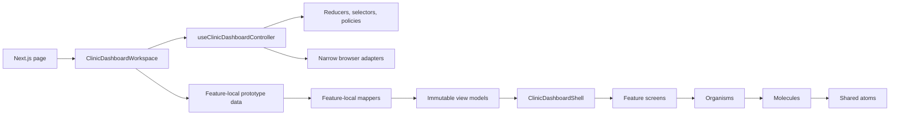

# Frontend Architecture, Storybook, and AI Drift Reduction Plan

> **Implemented planning record — 2026-07-16; baseline `d1a39bd0`.** This document records the component architecture, terminology, Storybook information architecture, AI instructions, mechanical safeguards, and executed migration for the prototype-backed Clinic Dashboard foundation. Historical current-state findings and phase baselines below refer to `d1a39bd0`. It does not authorize backend, authentication, storage, capability, or deployment-configuration work.

## Implementation Outcome

The migration was completed on one feature branch after the interaction-fix baseline merged. The phased pull-request sequence below remains the recommended review shape for a future migration of this size; it is not a claim that nine separate pull requests were created.

- Global feature code under `components/atoms`, `components/molecules`, `components/organisms`, and `components/templates` was replaced by business-area ownership under `features/clinic-dashboard`.
- `ClinicDashboardWorkspace`, `useClinicDashboardController`, and the domain-dumb `ClinicDashboardShell` now form the composition boundary.
- Feature controllers, reducers, selectors, command contracts, browser adapters, and prototype mappers are separate from screen rendering.
- Storybook now discovers colocated, business-owned stories with focused browser tests; the former 816-line application story was removed.
- Architecture and Storybook governance now fail on every finding, with no baseline or exemption.
- The pull-request Quality workflow owns formatting, static and governance checks, AI instruction checks, dead-code checks, unit and Storybook browser tests, Storybook and application builds, and the E2E smoke suite.
- A later bounded cleanup removed the raw Reviews CSV surface. The aggregate Dashboard profile-views export remains the only current CSV capability.

## Decision Summary

The target architecture is **feature-first and Atomic Design second**:

1. Clinic Dashboard code is owned by the business area that gives it meaning: workspace, dashboard, messages, reviews, clinic profile, or support.
2. Atomic Design classifies visual composition inside those areas. It is not used as a global dumping structure for hooks, state, policies, providers, fixtures, or data adapters.
3. `src/components` becomes a narrow domain-neutral UI area. Feature terminology must not leak into it.
4. `ClinicDashboardWorkspace` becomes the single smart composition root for cross-feature state. Dashboard reporting, reviews, clinic profile, messages, and support retain focused feature controllers. The workspace renders a domain-dumb `ClinicDashboardShell`.
5. Screens receive immutable view models and semantic actions. They do not import prototype data, session storage, visibility policy, or future data clients.
6. Business rules, state transitions, selectors, mapping, and non-React calculations become named pure modules with focused unit tests.
7. Stories are colocated with components and organized by business area first, Atomic layer second. Only a small set of cross-feature journey stories remains.
8. AI instruction quality, architecture boundaries, Storybook governance, and dead code remain separate checks with separate owners.
9. Migration is incremental by vertical slice, but every migrated slice cuts over directly. Permanent compatibility barrels, duplicate story hierarchies, and a second transitional architecture are not allowed.

These are the accepted implementation defaults. Changing one of them must update this plan, ADR 0002, and the frontend architecture authority before code diverges.

## User Outcome and Audience

Clinic Dashboard contributors, reviewers, and coding agents should be able to answer the following questions from a file path, component name, or Storybook title without first reading the implementation:

- Which business area owns this code?
- Is it UI composition, React orchestration, a business rule, a browser adapter, or prototype data?
- Which Atomic layer describes a visual component?
- Where is the component's direct Storybook evidence?
- Which test layer owns its behavior?
- Is a capability real, prototype-only, read-only, or unavailable?
- Which rule prevents an accidental cross-layer import or new architecture category?

The result should make the current prototype easier to maintain and make later Payload integration possible through an explicit adapter boundary, without implementing that integration now.

## Research and Evidence Basis

This plan combines repository evidence with the following primary guidance:

- [React: Components and Hooks must be pure](https://react.dev/reference/rules/components-and-hooks-must-be-pure)
- [React: Thinking in React](https://react.dev/learn/thinking-in-react)
- [React: Sharing State Between Components](https://react.dev/learn/sharing-state-between-components)
- [React: Choosing the State Structure](https://react.dev/learn/choosing-the-state-structure)
- [React: Extracting State Logic into a Reducer](https://react.dev/learn/extracting-state-logic-into-a-reducer)
- [React: You Might Not Need an Effect](https://react.dev/learn/you-might-not-need-an-effect)
- [React: Reusing Logic with Custom Hooks](https://react.dev/learn/reusing-logic-with-custom-hooks)
- [Next.js: Server and Client Components](https://nextjs.org/docs/app/getting-started/server-and-client-components)
- [Next.js: AI Coding Agents](https://nextjs.org/docs/app/guides/ai-agents)
- [Storybook: Writing Stories](https://storybook.js.org/docs/writing-stories)
- [Storybook: Naming Components and Hierarchy](https://storybook.js.org/docs/writing-stories/naming-components-and-hierarchy)
- [Storybook: Tags](https://storybook.js.org/docs/writing-stories/tags)
- [Storybook: Interaction Tests](https://storybook.js.org/docs/writing-tests/interaction-testing)
- [Storybook: Accessibility Tests](https://storybook.js.org/docs/writing-tests/accessibility-testing)
- [Brad Frost: Atomic Design Methodology](https://atomicdesign.bradfrost.com/chapter-2/)
- [OpenAI: Custom instructions with AGENTS.md](https://learn.chatgpt.com/docs/agent-configuration/agents-md)
- [OpenAI: Codex best practices](https://learn.chatgpt.com/guides/best-practices)

The local [findmydoc website repository](https://github.com/findmydoc-platform/website) was also reviewed as a pattern source. Its layered AI instructions, controlled component contracts, Storybook taxonomy, and separate governance checks are useful. Its global Atomic-first folders, oversized story suites, dual controlled/uncontrolled APIs, and internally drifting architecture documentation are specifically **not** templates for this repository.

## Historical Baseline Findings

The findings below describe only commit `d1a39bd0` before the migration. They are retained as decision evidence, not as current repository findings or a claim that the UI was functionally broken.

| Area                          | Confirmed current state                                                                                                                                                                                                                                    | Why it creates drift                                                                                                                                               |
| ----------------------------- | ---------------------------------------------------------------------------------------------------------------------------------------------------------------------------------------------------------------------------------------------------------- | ------------------------------------------------------------------------------------------------------------------------------------------------------------------ |
| Workspace orchestration       | Historical `ClinicDashboardApp.tsx` was 550 lines with 25 local states and two external-store subscriptions. It owned navigation plus review data, the clinic-profile draft, persistence commands, undo, support, dialogs, focus, and fixture composition. | A smart application root was classified as an organism and had become a cross-domain controller.                                                                   |
| Shell                         | Historical `ClinicDashboardTemplate.tsx` was 224 lines, imported the global fixture, applied capability policy, owned navigation state, and accepted 14 props.                                                                                             | The template could not be rendered or tested as a data- and policy-independent shell.                                                                              |
| Plan-to-code drift            | The lower-dashboard plan required a selected reporting snapshot to be passed into `DashboardOverview`, while historical `DashboardOverview.tsx` received a period and read fixture/policy data itself.                                                     | The documented owner and implemented owner of reporting selection differed.                                                                                        |
| Prototype data                | Historical `src/fixtures/clinic-dashboard.ts` was a 481-line cross-domain object. Product UI imported it directly from the workspace, shell, dashboard, messages, and dashboard dialogs. Navigation was mixed into the same file.                          | Views knew the temporary data source, and a later adapter could not replace it at one boundary.                                                                    |
| Commands                      | Historical `prototype-data-source.ts` combined profile, review, and support mutations in one `ClinicDashboardDataSource`.                                                                                                                                  | A consumer could depend on unrelated capabilities and the workspace became the default mutation owner.                                                             |
| Props                         | Historical `ClinicDashboardApp` exposed story-oriented initialization props; the shell exposed 14 state-shaped props; `MessagesWorkspaceView` exposed 17 props; `ClinicProfileEditor` exposed 24 props.                                                    | Internal implementation details leaked into public component contracts and made invalid combinations easier.                                                       |
| Atomic classification         | Historical `DashboardPrimitives.tsx`, `DashboardCards.tsx`, and `ClinicDashboardDialogs.tsx` each contained multiple differently owned components. `ThemeProvider` was under organisms.                                                                    | Atomic labels acted as storage buckets instead of composition semantics.                                                                                           |
| Terminology                   | `variant`, `interactive`, and a catch-all visibility gate hide prototype-policy meaning; `ClinicProfileEditor`, `ReviewsManagement`, and `PatientProfileDialog` imply capabilities or records that the current prototype does not provide.                 | Names make unsupported capability assumptions easy to repeat in code, stories, and AI output.                                                                      |
| Feature hotspots              | `ReviewsManagement` is 497 lines, `ClinicProfileEditor` is 448 lines, `ClinicProfileDialogs` exports four flows, `ReviewActionDialog` multiplexes four modes, and `SupportDialog` combines form state, validation, async I/O, and rendering.               | The UI merge added valuable behavior but concentrated ownership in a few globally classified components.                                                           |
| Storybook                     | The baseline had 63 story tests, with 36 in the 816-line historical `ClinicDashboardApp.stories.tsx`. Story discovery was limited to `src/stories`.                                                                                                        | Fifty-seven percent of component states were hidden inside one app suite, stories could not be colocated, and the sidebar was not organized by business ownership. |
| Shared interaction primitives | Native form controls and custom document-level menu/dialog behavior are repeated while only Button and Modal are established under `components/ui`.                                                                                                        | Styling, focus behavior, keyboard behavior, and props can drift independently.                                                                                     |
| Mechanical governance         | ESLint has the Next.js defaults; `ai:slop-check` checks instruction sources but not TSX imports, component ownership, or story metadata.                                                                                                                   | Written architecture rules have no deterministic enforcement.                                                                                                      |

### Historical strengths carried forward

- The project profile and prototype plan clearly prohibit real data, direct database access, and unapproved backend work.
- The baseline Storybook test project covered substantial keyboard, focus, responsive, and capability behavior.
- Global Storybook accessibility testing already fails on violations and must remain fail-closed.
- Historical `src/lib/clinic-dashboard` modules provided useful pure logic for messages, notifications, profile tasks, reporting, and visibility.
- The baseline Messages module demonstrated a partial orchestration/view split that could be refined rather than discarded.
- The baseline profile, reviews, and support modules contained useful pure types, validation, filtering, and command prototypes that could be moved rather than rebuilt.
- Light and dark mode are explicit project requirements.

## Scope

### In scope

- A feature-first, locally Atomic component structure.
- A stable terminology and ownership glossary.
- Splitting the smart workspace from its domain-dumb shell.
- Controlled and semantically named props.
- View models, reducers, selectors, mappers, and focused hooks.
- Splitting the prototype data monolith behind one composition boundary.
- Shared shadcn-aligned UI primitives required by current screens.
- Colocated Storybook stories, searchable titles, tags, global helpers, and focused interaction tests.
- Unit, Storybook, and end-to-end test ownership rules.
- Scoped AI guidelines and deterministic architecture/story governance checks.
- Direct, phased migration with validation and visual evidence.

### Explicitly out of scope

- Supabase authentication.
- Payload API integration or generated Payload types.
- Direct database access, service-role credentials, or new durable storage.
- New public routes or changes to the temporary password guard.
- Changes to the active production deployment, Vercel configuration, or production domain.
- New clinic, patient, analytics, review, messaging, or profile capabilities.
- Redesigning approved UI copy or visual direction as part of the structural migration.
- Adding speculative repositories, services, API clients, or empty adapter folders for future work.
- Copying the website repository's folder structure or governance scripts without adapting them to this repository.

## Access, Data Classification, and Storage Decision

Access remains private behind the existing temporary password guard. The unauthenticated route allowlist remains unchanged.

Production delivery is active according to `.codex/project-profile.toml`. This migration changes neither deployment configuration nor the production domain.

The current UI remains deterministic and prototype-backed. It contains no real clinic, patient, staff, message, review, or analytics data. The repository continues to use no durable application storage. The existing narrow use of browser session state for prototype mode and notification-read state may be reorganized but not expanded into a general persistence layer.

To make this boundary explicit, the migration distinguishes two concepts:

- `*.prototype-data.ts` is deterministic data intentionally used by the running foundation preview.
- `*.fixtures.ts` is test- or Storybook-only data and must never be imported by a production entry point.

Views and shells import neither form. Runtime prototype data is private and feature-local; the smart workspace and explicitly named prototype-data mappers are its only consumers. Independent fixtures live under each feature's `testing` directory. A later approved Payload adapter can replace these composition inputs without rewriting views, but no Payload code is created by this plan.

## Architecture Decision

### Ownership first, Atomic composition second

Atomic Design is a visual composition model, not a complete software architecture. Model code, reducers, selectors, hooks, adapters, providers, prototype data, and test fixtures do not receive an Atomic label.

The physical ownership hierarchy is:

```text
application route
  -> Clinic Dashboard bounded context
     -> workspace or business area
        -> UI composition layer
```

The rendering and logic flow is:



### Smart workspace and domain-dumb shell

`ClinicDashboardWorkspace` is the one smart composition root for the current prototype. It may:

- select and map prototype data;
- own cross-feature state through `useClinicDashboardController`;
- call reducers, selectors, and prototype capability policy;
- coordinate feature screens;
- persist the two approved session-scoped values through named browser adapters;
- translate user events into semantic feature actions.

`ClinicDashboardShell` is domain-dumb. It may:

- render app chrome, navigation, header utilities, the active content slot, and responsive layout;
- own strictly transient presentation state such as mobile drawer visibility;
- own narrowly scoped focus behavior required by its drawer or overlay.

It must not:

- import prototype data, test fixtures, policies, reducers, or data clients;
- choose the active business feature;
- decide which capability is available;
- own reporting period, notification read state, prototype mode, selected conversation, or dialog domain state;
- write to browser storage;
- infer business behavior from labels, IDs, or hidden controls.

This definition avoids two bad extremes: a shell that contains business orchestration and a stateless shell with dozens of props for purely local drawer mechanics.

## Target Directory Structure

Folders are created only when their first real file is migrated. Empty architectural placeholders are prohibited.

```text
src/
  app/
    page.tsx                         # route and composition only

  components/
    ui/                              # domain-neutral, shadcn-aligned UI
      button.tsx                     # flat shadcn registry; Atomic layer lives in stories
      avatar.tsx
      card.tsx
      modal.tsx
      page-heading.tsx
      rating-stars.tsx
      theme-toggle.tsx
    brand/
      BrandMark.tsx

  providers/
    ThemeProvider.tsx

  features/
    clinic-dashboard/
      AGENTS.md
      public.ts                       # explicit exports only; no wildcard barrel

      workspace/
        ClinicDashboardWorkspace.tsx
        ClinicDashboardShell.tsx
        useClinicDashboardController.ts
        browser-session.ts
        navigation.ts
        workspace.prototype-data.ts
        components/
          molecules/
            ClinicDashboardNavigation.tsx
          organisms/
        model/
          notifications.ts
          workspace.ts
        testing/
          workspace.fixtures.ts

      prototype/
        components/
          molecules/
            PrototypeModeSwitch.tsx
        prototype-mode.ts
        prototype-capabilities.ts
        prototype-commands.ts

      dashboard/
        public.ts
        dashboard.prototype-data.ts
        dashboard.prototype-data.mapper.ts
        hooks/
          useDashboardController.ts
        components/
          molecules/
          organisms/
            DashboardScreen.tsx
        model/
          dashboard-view-model.ts
          reporting.ts
          profile-tasks.ts
          profile-views-export.ts
          chart-geometry.ts
        testing/
          dashboard.fixtures.ts

      messages/
        public.ts
        messages.prototype-data.ts
        components/
          molecules/
            ConversationActionsMenu.tsx
            ConversationListItem.tsx
            MessageComposer.tsx
          organisms/
            MessagesScreen.tsx
            PatientInquiryProfileDialog.tsx
        model/
          messages.ts
          messages.reducer.ts
          messages.selectors.ts
        hooks/
          useMessagesController.ts
        testing/
          messages.fixtures.ts

      reviews/
        public.ts
        Reviews.tsx
        reviews.prototype-data.ts
        components/
          molecules/
          organisms/
            ReviewsScreen.tsx
            ReviewAppealDialog.tsx
            ReviewHistoryDialog.tsx
            ReviewNoteDialog.tsx
            ReviewResponseDialog.tsx
        model/
          review-dialog.ts
          reviews-view-model.ts
          reviews.reducer.ts
          reviews.selectors.ts
          review-commands.ts
          review-filters.ts
          review-pagination.ts
        hooks/
          useReviewsController.ts
        testing/
          reviews.fixtures.ts

      clinic-profile/
        public.ts
        ClinicProfile.tsx
        clinic-profile.prototype-data.ts
        components/
          molecules/
          organisms/
            ClinicProfileScreen.tsx
        model/
          clinic-profile.reducer.ts
          clinic-profile.ts
          clinic-profile-commands.ts
        hooks/
          useClinicProfileController.ts
        testing/
          clinic-profile.fixtures.ts

      support/
        public.ts
        components/
          organisms/
            SupportRequestDialog.tsx
        model/
          support-request.ts
          support-commands.ts
        hooks/
          useSupportRequestController.ts
        testing/
          support.fixtures.ts

      journeys/
        FoundationPreview.stories.tsx

  lib/
    browser/
      download-text-file.ts

  storybook/
    StorybookTheme.tsx
    viewports.ts
```

The tree is illustrative at file level, not a mandate to create every named primitive or selector immediately. A file is added only when the current implementation supplies a concrete responsibility for it.

## Dependency and Import Rules

| Source                                      | May import                                                                                 | Must not import                                                                      |
| ------------------------------------------- | ------------------------------------------------------------------------------------------ | ------------------------------------------------------------------------------------ |
| `app/**`                                    | providers and the Clinic Dashboard public entry                                            | feature internals, prototype data details, test fixtures                             |
| `ClinicDashboardWorkspace.tsx`              | feature public contracts, workspace model, explicit private composition modules, shared UI | unrelated feature-private leaf components, test fixtures, future Payload clients     |
| Other `workspace/**`                        | feature public contracts, workspace model, shared UI                                       | private sibling internals, runtime prototype data or commands, test fixtures         |
| Feature `components/**`                     | same-feature model types/selectors where render-safe, same-feature lower layers, shared UI | prototype data, test fixtures, browser adapters, sibling-feature internals, `app/**` |
| Feature `model/**`                          | TypeScript-only domain types and pure functions                                            | React, Next.js, DOM APIs, browser storage, components                                |
| Feature `hooks/**`                          | React, same-feature model, named adapters                                                  | JSX-heavy composition, test fixtures, unrelated feature internals                    |
| Browser adapters                            | platform APIs and serializable model types                                                 | React components and Storybook code                                                  |
| `components/ui/**`                          | React, Radix/shadcn dependencies, design tokens, domain-neutral utilities                  | `features/**`, prototype data, app routes, domain models                             |
| `providers/**`                              | provider libraries and domain-neutral configuration                                        | Clinic Dashboard feature behavior                                                    |
| `storybook/**`, `testing/**`, `*.stories.*` | components, public contracts, independent fixtures, command fakes, Storybook APIs          | runtime prototype sources or production entry-point imports in the reverse direction |

Additional rules:

- A feature area may import a sibling area only through its small explicit `public.ts` contract. Wildcard exports are forbidden.
- General `public.ts` contracts never export runtime prototype data or runtime command implementations.
- `ClinicDashboardWorkspace` has one narrow private composition exception: feature-local runtime prototype data, explicitly named `*.prototype-data.mapper.ts` modules, the runtime prototype command implementation, and `PrototypeModeSwitch`. These imports remain private and must not be re-exported.
- `shared` is a concept, not a catch-all folder. This repository keeps shared UI under `src/components`; generic `src/shared`, `common`, `misc`, and `helpers` buckets are not introduced.
- A component moves to shared UI only when it is clearly domain-neutral or already has at least two independent feature consumers.
- Lower Atomic layers do not import higher Atomic layers.
- Circular feature dependencies are release blockers.

## Terminology Contract

| Term           | Exact meaning                                                                                                  | Naming rule                                                                                                          |
| -------------- | -------------------------------------------------------------------------------------------------------------- | -------------------------------------------------------------------------------------------------------------------- |
| Workspace      | Product-facing composition root for the complete Clinic Dashboard surface.                                     | `ClinicDashboardWorkspace` is smart and unique. Do not use `App` as an architectural role.                           |
| Controller     | React orchestration for related state, events, and external synchronization.                                   | Prefer a named hook such as `useClinicDashboardController`; do not put markup-heavy rendering in it.                 |
| Shell          | Domain-dumb application layout and slots. Atomic equivalent: template.                                         | `*Shell`; no data source, policy, or business-state ownership.                                                       |
| Screen         | Complete business-area content rendered inside the shell. Atomic classification: organism in this application. | `DashboardScreen`, `MessagesScreen`, `ReviewsScreen`, `ClinicProfileScreen`.                                         |
| View           | Props-only rendering paired with a controller when `Screen` would be inaccurate.                               | Use only when there is a real controller/view pair; do not suffix every component with `View`.                       |
| Model          | Domain types and invariants independent of React.                                                              | `*.model.ts` only when one specific name is not clearer.                                                             |
| View model     | Immutable, render-ready data with no transport or prototype-data shape leakage.                                | `*ViewModel`; created before the screen boundary.                                                                    |
| Reducer        | Pure state transition function.                                                                                | `*.reducer.ts`; action names describe events, not setters.                                                           |
| Selector       | Pure derivation from model state or view-model inputs.                                                         | `*.selectors.ts` or a specific named file.                                                                           |
| Mapper         | Pure shape conversion with no I/O.                                                                             | `*.mapper.ts`; transport/prototype input to model/view model.                                                        |
| Commands       | Small business-area mutation contract used by a controller.                                                    | `ReviewCommands`, `ClinicProfileCommands`, or `SupportCommands`; never pass a cross-domain command object.           |
| Adapter        | Boundary to browser or future external capability.                                                             | Name the capability, for example `browser-session.ts`; never create a generic adapter bucket without a real adapter. |
| Hook           | Reusable React state/lifecycle behavior.                                                                       | `use*`; pure calculations never use this suffix.                                                                     |
| Prototype mode | Temporary `visual-reference` or `presentation` behavior.                                                       | Replace generic `variant`; the public type is `ClinicDashboardPrototypeMode`.                                        |
| Prototype data | Deterministic runtime data for the current foundation preview.                                                 | `*.prototype-data.ts`; only the workspace or a named prototype-data mapper may import it.                            |
| Fixture        | Story/test-only deterministic data.                                                                            | `*.fixtures.ts`; production code never imports it.                                                                   |
| Primitive      | Domain-neutral UI leaf or compound control.                                                                    | Reserved for `components/ui`; never a multi-component dump filename.                                                 |

Avoid `Manager`, `Utils`, `Helpers`, `Common`, `Misc`, `Primitives`, `Data`, and `App` when a business responsibility can be named directly.

### Historical rename and ownership map

The source names in the first column refer to the `d1a39bd0` baseline. The target column records the implemented ownership decision.

| Historical source                    | Implemented target                                             | Reason                                                                       |
| ------------------------------------ | -------------------------------------------------------------- | ---------------------------------------------------------------------------- |
| `ClinicDashboardApp`                 | `ClinicDashboardWorkspace`                                     | Product composition root, not an organism.                                   |
| `ClinicDashboardTemplate`            | `ClinicDashboardShell`                                         | Domain-dumb app chrome; avoids collision with Next.js template terminology.  |
| `ClinicDashboardVariant` / `variant` | `ClinicDashboardPrototypeMode` / `prototypeMode`               | Describes temporary capability presentation, not a visual component variant. |
| `InterfaceModeSwitch`                | `PrototypeModeSwitch`                                          | Makes its non-product, prototype-only role explicit.                         |
| `DashboardOverview`                  | `DashboardScreen`                                              | Complete dashboard business-area content.                                    |
| `MessagesWorkspace`                  | `useMessagesController` plus `MessagesScreen`                  | Separates orchestration from rendering.                                      |
| `MessagesWorkspaceView`              | `MessagesScreen`                                               | Makes the user-visible role clearer.                                         |
| `ReviewsManagement`                  | `ReviewsScreen`                                                | Does not imply all management operations are implemented.                    |
| `ClinicProfileEditor`                | `ClinicProfileScreen`                                          | Does not imply durable editing is implemented.                               |
| `PatientProfileDialog`               | `PatientInquiryProfileDialog`                                  | Preserves the limited inquiry context and avoids implying a medical record.  |
| `WorkspaceHeading`                   | `PageHeading`                                                  | Domain-neutral UI purpose.                                                   |
| `SurfaceCard`                        | shared `Card`                                                  | Domain-neutral surface contract.                                             |
| `AvatarInitials`                     | shared `Avatar`                                                | The component also renders an image.                                         |
| `DashboardPrimitives.tsx`            | separate `Avatar`, `RatingStars`, and `PageHeading` files      | One owner and one public component per file.                                 |
| `DashboardCards.tsx`                 | shared `Card`, dashboard `MetricCard`, reviews `RatingSummary` | Separates technical UI from business-owned composition.                      |
| `ClinicDashboardDialogs.tsx`         | three feature-owned dialog files                               | Patient inquiry, treatment, and team-member flows have different owners.     |
| `ClinicDashboardDataSource`          | three business-area command contracts                          | Prevents consumers from depending on unrelated mutations.                    |
| `ClinicProfileDialogs.tsx`           | four Clinic Profile dialog files                               | Makes each profile flow independently testable.                              |
| `ReviewActionDialog`                 | typed review action contracts or focused dialog flows          | Removes the generic mode and submit payload.                                 |
| `SupportDialog`                      | `useSupportRequestController` and `SupportRequestDialog`       | Separates validation and async commands from rendering.                      |
| `ThemeProvider` under organisms      | `src/providers/ThemeProvider.tsx`                              | Provider infrastructure has no Atomic layer.                                 |

At baseline, one catch-all visibility gate grouped unrelated capabilities. The migration replaces it with the explicit `certificateTasks`, `notifications`, and `support` policy fields, which independently derive `showCertificateTasks`, `showNotifications`, and `showSupport`. Reply templates remain owned by `messaging`; the aggregate profile-views export remains owned by Dashboard reporting, while Reviews exposes no export. No appointment capability is emitted because the current UI has no appointment surface.

## Atomic Design Contract

Atomic classification answers **how a visual component composes**, not where every source file goes.

| Layer    | Project definition                                                          | Examples                                                                   | Not a deciding factor                        |
| -------- | --------------------------------------------------------------------------- | -------------------------------------------------------------------------- | -------------------------------------------- |
| Atom     | Smallest domain-neutral UI unit with one visual/control responsibility.     | Button, Input, Avatar, RatingStars                                         | Line count or whether it has internal state. |
| Molecule | Focused combination of atoms that performs one coherent UI task.            | Field, MetricCard, ConversationListItem, PeriodControl                     | Merely being interactive.                    |
| Organism | Distinct interface section with a recognizable product responsibility.      | NotificationCenter, ConversationList, DashboardMetricPanel, MessagesScreen | Import count or file length alone.           |
| Template | Page/workspace layout and content slots without concrete business data.     | ClinicDashboardShell                                                       | A folder for all large components.           |
| Page     | Concrete template instance used to validate realistic content and journeys. | ClinicDashboardWorkspace, Foundation Preview, Next.js route composition    | A reusable component layer.                  |

Operational rules:

- Atomic folders exist under a specific feature's `components`. The shared shadcn registry stays flat under `components/ui`; its Atomic layer is expressed through its contract and Storybook metadata.
- Do not create an Atomic folder for a single file merely to satisfy symmetry.
- State, hooks, reducers, selectors, mappers, policies, adapters, providers, and prototype data remain outside Atomic folders.
- An organism may be interactive; a molecule may also be interactive. Interaction does not define the layer.
- Screens in this application are organisms because they are distinct sections inside one workspace shell. The shell maps to the template layer. Concrete workspace and journey compositions map to pages.
- If a component cannot be classified from this table, do not invent a sixth layer. Clarify its responsibility or update the architecture decision explicitly.

## Props and Component API Contract

### Required defaults

- Use one public React component per file and named exports.
- Colocate the component's props type. Export the type only when another production module genuinely needs it.
- Destructure props at the function boundary.
- Treat object and array inputs as read-only.
- Use semantic callback names: `onConversationSelect`, `onReviewReplySubmit`, `onProfileTaskOpen`.
- Technical primitives use established controlled pairs: `value/onValueChange`, `open/onOpenChange`, and `checked/onCheckedChange`.
- Domain components are controlled for business state. Internal state is reserved for transient UI mechanics such as hover, focus, or an unimportant popover state.
- Use `is*`, `has*`, `can*`, or `show*` for true booleans.
- Use discriminated unions for mutually exclusive states instead of combinations such as `loading`, `error`, `empty`, and `ready`.
- Use slots or `children` for layout composition instead of a growing list of special-case render booleans.
- Props crossing a Server/Client Component boundary must be serializable.

Example screen boundary:

```ts
type MessagesScreenProps = Readonly<{
  model: MessagesViewModel
  actions: MessagesActions
}>
```

At a screen boundary, the `model` and `actions` grouping is allowed because each object has a coherent contract. Leaf components should receive the smallest named props they use rather than a complete screen model.

### Forbidden defaults

- React state setters as props.
- Generic `onAction`, `data`, `config`, or `options` objects that hide unrelated responsibilities.
- Passing the complete Clinic Dashboard prototype object through the tree.
- Props that expose DOM refs or HTML elements to domain orchestration when a semantic action or accessible primitive can own focus restoration.
- Both controlled and uncontrolled domain APIs on the same component.
- Broad prop spreading in feature components.
- Boolean props that permit impossible business combinations.
- Automatic `memo`, `useMemo`, or `useCallback` without measured need or a concrete identity contract.
- Large wildcard export barrels.

More than roughly ten props, multiple state owners, or more than one business responsibility is a review signal, not a blocking numeric rule. Hard line or prop limits encourage artificial splitting and are not governance gates.

## State, Business Logic, and Helper Extraction

### State ownership

- Each fact has one owner.
- Derived values are computed by selectors, not stored as parallel state.
- Entity selection is represented by an ID, not by a duplicated object snapshot.
- Cross-feature transitions stay behind semantic workspace-controller actions. Introduce a pure workspace reducer when multiple related values can otherwise form invalid states; do not add one only to replace independent named state.
- Reporting state stays with Dashboard unless another feature has an approved need for it.
- Messages selection, search, read state, draft state, and local prototype messages use a Messages reducer/selectors where their transitions are related.
- Session persistence wraps domain state; it does not become the state owner.

### Effects

Effects are allowed only for synchronization with an external system or a real DOM accessibility requirement:

- session storage persistence;
- focus restoration or announced status;
- document-level interaction required by a shared overlay primitive;
- future approved network subscriptions.

Filtering, counting, capability evaluation, report selection, prop synchronization, and other render-time derivations do not use Effects.

The existing custom same-document storage events should be removed if the single workspace owner makes them unnecessary. If a cross-root synchronization need is proven, it receives one tested adapter rather than feature-level `window` events.

### Pure module extraction rule

Extract a function from JSX when at least one of the following is true:

- it expresses a business or capability rule;
- it performs a non-trivial transition;
- it maps an external/prototype shape into a stable model;
- it is reused;
- it has meaningful edge cases worth testing independently;
- it performs chart geometry or other deterministic calculation.

Keep a function private and local when it is used once, is presentation-only, and is clearer beside the render code. Do not create `helpers.ts` or `utils.ts` merely to shorten a component.

### Current logic relocation

| Current module                                        | Target owner                                                                                 |
| ----------------------------------------------------- | -------------------------------------------------------------------------------------------- |
| `src/lib/clinic-dashboard/reporting.ts`               | `dashboard/model/reporting.ts`                                                               |
| `src/lib/clinic-dashboard/profile-tasks.ts`           | Dashboard or clinic-profile model after confirming the task's user owner; no duplicated copy |
| `src/lib/clinic-dashboard/messages.ts`                | `messages/model`                                                                             |
| `src/lib/clinic-dashboard/notifications.ts`           | `workspace` notification model                                                               |
| `src/lib/clinic-dashboard/visibility.ts`              | `prototype/prototype-capabilities.ts`                                                        |
| Chart point/geometry calculations embedded in UI      | `dashboard/model/chart-geometry.ts`                                                          |
| Browser session serialization in `ClinicDashboardApp` | named workspace/prototype browser-session functions and controller hook                      |

Security, environment parsing, public-route policy, and genuinely cross-cutting utilities remain outside the feature.

## Storybook Information Architecture

### Discovery and colocation

Change story discovery from `src/stories/**/*.stories.*` to `src/**/*.stories.*`. A component's primary story is placed beside the component. Cross-feature journey stories live in one explicit Clinic Dashboard journey area, not beside a random component.

Autodocs is the default for public shared and feature components. MDX is reserved for cross-component guidance such as how to find stories or how prototype data differs from test fixtures. Component README duplication is not introduced.

### Sidebar contract

Titles carry the primary navigation. Tags carry cross-cutting filters.

```text
Shared/Atoms/Button
Shared/Molecules/Dialog
Clinic Dashboard/Workspace/Templates/Clinic Dashboard Shell
Clinic Dashboard/Workspace/Pages/Clinic Dashboard Workspace
Clinic Dashboard/Dashboard/Molecules/Metric Card
Clinic Dashboard/Dashboard/Organisms/Dashboard Screen
Clinic Dashboard/Messages/Molecules/Conversation List Item
Clinic Dashboard/Messages/Organisms/Messages Screen
Clinic Dashboard/Reviews/Organisms/Reviews Screen
Clinic Dashboard/Clinic Profile/Organisms/Treatment Dialog
Clinic Dashboard/Support/Organisms/Support Request Dialog
Clinic Dashboard/Journeys/Pages/Foundation Preview
```

The required tag vocabulary is deliberately small:

- exactly one `domain:*`: `shared`, `workspace`, `dashboard`, `messages`, `reviews`, `clinic-profile`, or `support`;
- exactly one `layer:*`: `atom`, `molecule`, `organism`, `template`, or `page`;
- exactly one `status:*`: `stable` or `prototype`;
- optional `used-in:*` only when it materially improves search.

`autodocs` should be configured globally. Journey stories opt out when their generated API documentation adds no value.

### Story tiers

1. **Shared UI and reusable feature components**
   - Direct story required.
   - Relevant visual states and controlled props.
   - Keyboard/focus interaction test for interactive behavior.
   - Autodocs and usable Controls.

2. **Feature screens**
   - Direct stories for ready, empty, read-only/unavailable, long-content, mobile, and error/loading states only where those states exist in the approved model.
   - Screen stories receive view models and action spies; they do not instantiate the smart workspace.
   - One focused `play` flow per coherent behavior.

3. **Workspace journeys**
   - Four to six cross-feature stories only: default visual reference, presentation mode, mobile navigation, a representative dialog/focus flow, and one or two essential cross-section journeys.
   - No duplicate copy of every feature state.
   - These stories validate composition, not leaf component APIs.

### Story authoring rules

- `meta.component` is required.
- Use typed CSF meta and stories.
- Prefer `args` and Storybook action spies.
- Use a small named controlled harness only when user interaction must update a controlled value inside the story.
- Reuse semantic fixture builders or child story args; do not copy large prototype objects into story files.
- Await all user events and assertions.
- Query by accessible role/name before test IDs.
- Do not assert Tailwind class names, SVG path data, or internal state.
- Viewport variants use the central viewport catalog rather than repeated inline objects.
- A story name describes a user-visible state: `Default`, `Empty`, `Read Only`, `Long Content`, or `Keyboard Navigation`. Avoid vague names such as `Example2` or duplicated viewport-only sidebar entries.

### Global Storybook configuration

Centralize the following in `.storybook/preview.ts` or focused Storybook helpers:

- accessibility with `test: "error"`;
- a canonical mobile, tablet, and desktop viewport matrix;
- theme selection and both-theme rendering support;
- global layout defaults with per-story exceptions;
- stable story sorting that matches the actual root groups;
- required providers and portal roots;
- global Autodocs;
- Controls defaults.

Resolve the baseline theme-related console noise in Storybook tests as part of the migration. Do not hide warnings globally; remove the incorrect provider/script behavior or scope it away from tests.

## Test Strategy

| Test layer              | Owns                                                                                                                                  | Does not own                                                         |
| ----------------------- | ------------------------------------------------------------------------------------------------------------------------------------- | -------------------------------------------------------------------- |
| Vitest unit             | reducers, selectors, prototype capability policy, serialization, mappers, reporting calculations, chart geometry, message transitions | DOM layout, complete workspace journeys                              |
| Storybook browser tests | component states, controlled props, keyboard/focus behavior, dialogs/menus, responsive screens, accessibility                         | backend contracts, auth routing, many-step cross-feature duplication |
| Playwright E2E          | temporary auth guard and a small number of real cross-feature journeys through the Next.js route                                      | exhaustive component states or pure business logic                   |
| Integration             | none until an approved persistent data/API boundary exists                                                                            | speculative API mocks presented as integration coverage              |

Migration requirements:

- Preserve every meaningful behavior covered by the historical story suite at `d1a39bd0`, but redistribute it to the correct tier. The final export count may change.
- Add direct unit tests before or with extraction of business logic.
- Keep accessibility fail-closed.
- Verify the narrow mobile viewport first, then tablet and desktop.
- Verify light and dark mode for every UI migration. Theme/color changes require both-theme screenshot evidence.
- Preserve focus return, Escape behavior, outside-click behavior, and no-horizontal-overflow behavior.
- Do not replace behavior tests with snapshots alone.

## AI Guidelines and Drift Prevention

### One owner per rule

| Source                                               | Owns                                                                                    |
| ---------------------------------------------------- | --------------------------------------------------------------------------------------- |
| Root `AGENTS.md`                                     | fixed project, security, access, language, validation, and delivery constraints         |
| `docs/adr/0002-feature-first-atomic-architecture.md` | the architectural decision and why alternatives were rejected                           |
| `docs/engineering/frontend-architecture.md`          | detailed terminology, layer table, imports, props, Storybook taxonomy, and examples     |
| `src/features/AGENTS.md`                             | concise feature-local execution rules and link to the architecture document             |
| `src/components/ui/AGENTS.md`                        | domain neutrality, shadcn/design-token use, accessibility, and direct-story requirement |
| `.storybook/AGENTS.md`                               | global configuration, decorators, provider, viewport, and story-test rules              |
| `.codex/skills/ui-storybook/SKILL.md`                | workflow: what contributors must read, implement, validate, and show                    |
| Deterministic scripts/ESLint                         | rules that can be checked mechanically                                                  |

Other files link to the owner instead of repeating the full rule. Root instructions stay short and stable. A new instruction is added only after a repeated failure or when it protects a fixed project boundary.

### Version-matched Next.js guidance

The migration adds the official minimal Next.js agent rule to root instructions: before Next.js work, read the relevant version-matched documentation under `node_modules/next/dist/docs/`. The installed package is the source of truth for the repository's exact Next.js version.

### AI anti-slop signals for this architecture

Agents and reviewers should stop and reclassify work when they see:

- a new `Utils`, `Helpers`, `Common`, `Misc`, `Primitives`, or multi-dialog dump file;
- a feature component proposed under global shared UI;
- an empty future `services`, `repositories`, or adapter structure;
- a component that accepts both controlled and uncontrolled business state;
- a view that imports prototype data, storage, or capability policy;
- a shell that decides business availability;
- business rules embedded in JSX or Effects;
- multiple booleans representing mutually exclusive states;
- a second story hierarchy or nearly identical viewport stories;
- a new architecture term missing from the glossary;
- a copied rule with no single owner;
- a generic abstraction justified only by possible future reuse.

### Separate deterministic gates

Keep checks narrow:

- `ai:slop-check`: instruction discovery, objective budgets, and effective-scope conflicts.
- `architecture:check`: import direction, ownership, model purity, fixture/prototype-data boundaries, and forbidden catch-all file names.
- `stories:governance:check`: colocation, title hierarchy, component metadata, allowed tags, title/path/tag agreement, and required direct coverage.
- `deadcode:check`: unused files and exports.

The architecture and story checks should use the TypeScript/ESLint syntax tree or another structured parser where semantics matter. A title regex alone is insufficient.

The implemented checkers are strict. They report one undifferentiated finding set and exit unsuccessfully when any finding exists; there is no baseline or transitional classification.

`tests/unit/architecture-policy-check.test.ts` validates the real architecture checker as a child process against temporary accepted and rejected repository graphs. `pnpm check` composes lint, type checking, both governance checks, AI instruction checks, and dead-code checks. The pull-request `Quality` workflow then owns unit tests, Storybook browser tests, Storybook and application builds, and the E2E smoke suite in addition to formatting and `pnpm check`; any failing step fails that workflow.

### Minimum mechanical rules

`architecture:check` rejects:

- `components/ui/**` importing `features`, prototype data, fixtures, or app routes;
- feature UI importing prototype data, test fixtures, browser storage, or future data clients;
- `model/**` importing React, Next.js, components, DOM, or browser storage;
- adapters importing React components;
- sibling areas importing another area's internals rather than its public contract;
- `*Shell`, `*Screen`, or `*View` importing `*.prototype-data` or `*.fixtures`;
- feature files named `*Helpers`, `*Utils`, `*Primitives`, `*Common`, or `*Misc`;
- wildcard exports from feature public contracts.

`stories:governance:check` rejects:

- a story outside the component's feature unless it is an approved journey;
- a title whose area or layer disagrees with its path;
- a missing `meta.component`;
- a missing or unknown domain/layer/status tag;
- `Shared/**` combined with a feature domain tag;
- a public shared or reusable feature component without a direct story;
- production imports from `testing`, Storybook, or `*.fixtures`.

## Historical Phased Migration Record

The phases below describe the completed migration from `d1a39bd0`. Their boundaries remain a recommended review shape for a future migration of comparable size, but they are not current exceptions or pending work.

### Phase 0 — Freeze the baseline and approve the architecture contract

**Goal:** make behavior and boundaries explicit before paths change.

Work:

1. Record the post-interaction-fix baseline: 34 unit tests and 63 Storybook tests on `d1a39bd0`.
2. Confirm the proposed glossary, target tree, import matrix, Storybook title scheme, and rename table.
3. Create `docs/adr/0002-feature-first-atomic-architecture.md` from the approved decision.
4. Create `docs/engineering/frontend-architecture.md` as the detailed authority.
5. Link this plan to the existing prototype/capability plan instead of duplicating its gate matrix.
6. Mark the merged 20 UI interaction corrections, visual copy, and behavior as preservation constraints for the structural migration.

Exit criteria:

- Every current source area maps to one target owner.
- No unresolved decision changes the folder topology or public component roles.
- No UI or runtime behavior changes in this phase.

### Phase 1 — Install AI and mechanical governance

**Goal:** make the approved vocabulary and ownership discoverable to humans and agents.

Work:

1. Keep root `AGENTS.md` concise; add the version-matched Next.js documentation rule and links to the architecture authority.
2. Add scoped rules for `src/features`, `src/components/ui`, and `.storybook`.
3. Update the UI/Storybook skill to read the architecture authority before component work.
4. Add `architecture:check` and `stories:governance:check` with deterministic findings and non-zero exits.
5. Migrate affected files with the checker rules so the repository reaches zero findings without an allowlist.
6. Keep `ai:slop-check` focused on instruction quality.

Exit criteria:

- A coding agent entering any target path reaches the correct local rules.
- Checks fail locally on every finding.
- Architecture checker process fixtures prove accepted and rejected dependency graphs.

### Phase 2 — Normalize Storybook infrastructure and shared UI

**Goal:** create stable foundations before feature components move.

Work:

1. Change Storybook discovery to colocated stories.
2. Centralize viewport definitions, theme/provider setup, Autodocs, story sorting, Controls, and accessibility.
3. Split `DashboardPrimitives.tsx` and `DashboardCards.tsx` into individually owned components.
4. Move `BrandMark` to brand and `ThemeProvider` to providers.
5. Introduce only the shadcn-aligned primitives required by the baseline migration: Button, Input, Textarea, Select, Card, Avatar, Dialog, DropdownMenu, and Field where actual usages exist.
6. Replace repeated native-control style recipes and custom overlay mechanics incrementally.
7. Add direct stories and focused interaction tests for each shared interactive component.

Exit criteria:

- Shared UI has no Clinic Dashboard imports or terminology.
- Shared interactive components have direct stories and keyboard/focus evidence.
- Storybook has one global viewport/theme/a11y configuration and no known theme console error.
- No speculative primitive is added.

### Phase 3 — Cut the smart workspace from the domain-dumb shell

**Goal:** establish the central architectural seam.

Work:

1. Rename `ClinicDashboardApp` to `ClinicDashboardWorkspace` and move it under the bounded context.
2. Extract a narrow `useClinicDashboardController`; add a pure workspace reducer or selectors only where cross-feature transitions require them. Keep Reviews, Clinic Profile, Messages, and Support state in their feature controllers.
3. Move prototype mode and notification read persistence into named session modules/hooks.
4. Remove same-document custom storage events if one owner makes them redundant.
5. Rename `ClinicDashboardTemplate` to `ClinicDashboardShell`.
6. Move navigation configuration out of prototype data and into workspace navigation.
7. Remove fixture imports, capability policy, reporting decisions, and business state from the shell.
8. Keep only local drawer/focus mechanics in the shell.
9. Replace DOM-ref props with semantic actions or shared accessible primitive focus restoration.
10. Add isolated shell stories plus four-to-six initial workspace journey stories.

Exit criteria:

- Route -> Workspace -> Shell is visible in code and tests.
- Shell renders from props/slots without prototype-data or policy imports.
- Cross-feature state transitions are unit tested.
- Current navigation, dialogs, focus return, prototype mode, and notification behavior remain equivalent.

### Phase 4 — Migrate Dashboard as the first vertical slice

**Goal:** prove the model/view-model/screen pattern on the largest read-heavy area.

Work:

1. Rename `DashboardOverview` to `DashboardScreen` and move it to Dashboard ownership.
2. Pass the selected reporting snapshot/view model into the screen, resolving the confirmed plan-to-code drift.
3. Move reporting and relevant profile-task logic into pure Dashboard model files.
4. Extract deterministic chart geometry from rendering.
5. Split the screen into meaningful molecules/organisms: metric grid/cards, funnel, profile completeness, dashboard metric panel, rating summary consumer, and clinic preview.
6. Keep domain-neutral Card, Avatar, RatingStars, and PageHeading in shared UI.
7. Add focused unit tests for reporting, selectors, capability behavior, and chart geometry.
8. Add direct stories for the screen and reusable Dashboard components.

Exit criteria:

- Dashboard UI has no direct prototype-data or visibility-policy imports.
- The reporting period has one owner and the screen receives a render-ready model.
- Storybook contains Dashboard states outside the workspace journey suite.

### Phase 5 — Migrate Messages and reduce the 17-prop view boundary

**Goal:** convert the existing partial container/view split into an explicit controller/model/screen boundary.

Work:

1. Replace the historical Messages container with `useMessagesController` and `MessagesScreen`.
2. Move selection, search, read state, draft, local prototype messages, and mobile thread transitions into a reducer/selectors where related.
3. Build a `MessagesViewModel` containing already filtered groups, selected conversation, counts, and visible messages.
4. Replace the 17 flat props with coherent `model` and `actions` screen contracts; pass smaller props to leaf components.
5. Keep document/focus behavior in named accessibility hooks or shared overlay primitives, not business selectors.
6. Move ConversationListItem, ConversationActionsMenu, MessageComposer, and related components into Messages Atomic folders.
7. Add unit tests for selectors/transitions and Storybook tests for search, selection, sending, menu keyboard behavior, read-only mode, and mobile thread navigation.

Exit criteria:

- The Messages screen performs no business filtering or prototype capability lookup during render.
- No impossible selected/read/mobile combinations are representable in the reducer state.
- Messages component states are directly discoverable in Storybook.

### Phase 6 — Migrate Reviews and its command boundary

**Goal:** separate review state, filtering, mutations, and rendering.

Work:

1. Split `ReviewCommands` from the cross-domain data source.
2. Extract `useReviewsController`, a review reducer, and selectors for filters, pagination, and mutation state.
3. Rename `ReviewsManagement` to `ReviewsScreen` and provide a reviews view model/actions contract.
4. Keep Reviews free of download behavior; the raw Reviews CSV serializer and browser adapter were removed by the later export cleanup.
5. Replace the generic review-action submit payload with typed review actions.
6. Move review UI into its local Atomic folders.
7. Add unit tests and direct stories for filtering, retry, response, appeal, notes, history, explicit export absence, read-only, and mobile states.

Exit criteria:

- The workspace does not own review entities or mutations.
- The Reviews screen imports neither commands nor browser APIs.
- Retry behavior is deterministic per Storybook render.

### Phase 7 — Migrate Clinic Profile and Support

**Goal:** move the two remaining stateful workflows behind focused controllers and typed commands.

Work:

1. Split `ClinicProfileCommands` and `SupportCommands` from the cross-domain data source.
2. Extract `useClinicProfileController` with a pure draft/revision/undo reducer.
3. Rename `ClinicProfileEditor` to `ClinicProfileScreen` and provide a profile view model/actions contract.
4. Split `ClinicProfileDialogs.tsx` and the team/treatment dialogs into independently owned files.
5. Extract `useSupportRequestController` and rename the rendering component to `SupportRequestDialog`.
6. Split `ClinicDashboardDialogs.tsx`; move patient inquiry to Messages and team/treatment flows to Clinic Profile.
7. Move focus/scroll behavior to named feature hooks and replace boolean availability props with typed actions/capability behavior.
8. Add pure reducer/validation tests and focused Storybook coverage for profile, support, dialog, focus, error, and mobile states.

Exit criteria:

- The workspace does not own profile draft mutations or support-form state.
- No screen or dialog imports global prototype data or the cross-domain command source.
- Names do not imply unsupported persistence, management, or medical records.
- Dialog focus management is covered by Storybook interaction tests.

### Phase 8 — Split prototype data and complete Storybook redistribution

**Goal:** remove the cross-domain monolith and the centralized story monolith.

Work:

1. Split the 481-line runtime prototype object into private feature-local `*.prototype-data.ts` modules and explicitly named feature-local mappers where shape conversion is required.
2. Limit runtime prototype-data imports to the workspace composition root and explicitly named `*.prototype-data.mapper.ts` modules.
3. Create Storybook/test fixtures separately from runtime prototype data.
4. Move all direct component stories beside their components.
5. Redistribute the 36 app stories to Dashboard, Messages, Reviews, Clinic Profile, Support, shared UI, and focused journeys.
6. Delete the old 816-line app story rather than retaining a compatibility copy.
7. Keep only four to six workspace journey stories.
8. Delete old Atomic-first feature folders, multi-component dump files, and obsolete story folders after their final consumer moves.

Exit criteria:

- Production code has no imports from `testing`, Storybook, or `*.fixtures`.
- Feature UI has no imports from `*.prototype-data`.
- The Storybook sidebar is searchable by business area and Atomic layer.
- Every reusable public component and screen has direct coverage or a documented private-component exclusion.

### Phase 9 — Verify strict governance and remove obsolete code

**Goal:** prevent regression after migration.

Work:

1. Verify that architecture and Storybook governance have no baselines, allowlists, or transitional classifications.
2. Keep `architecture:check` and `stories:governance:check` blocking in the package validation workflow.
3. Run dead-code analysis and remove unused exports, compatibility aliases, and obsolete fixtures.
4. Reconcile the ADR, engineering guide, scoped AGENTS files, skill, and package scripts for one owner per rule.
5. Run the complete validation and visual review matrix.
6. Recommend the matching read-only Storybook, React, accessibility, and instruction reviewers; run them only after user confirmation.
7. Present reviewer findings before any reviewer-driven fixes.

Exit criteria:

- No known architecture or story governance exceptions remain.
- Documentation, file paths, Storybook titles, and mechanical checks describe the same architecture.
- The repository is ready for later data-boundary planning without containing speculative integration code.

## Recommended Pull Request Sequence

| PR  | Scope                                                      | Why this boundary is reviewable                                    |
| --- | ---------------------------------------------------------- | ------------------------------------------------------------------ |
| 1   | ADR, engineering guide, scoped AI rules, governance checks | Governance-only; no UI behavior change.                            |
| 2   | Storybook globals and shared UI cleanup                    | Establishes primitives and story conventions before feature moves. |
| 3   | Workspace/controller/shell cut                             | One central seam with cross-feature smoke evidence.                |
| 4   | Dashboard vertical slice                                   | Proves view-model and pure-logic pattern on a read-heavy area.     |
| 5   | Messages vertical slice                                    | Isolates the highest interaction/state migration.                  |
| 6   | Reviews vertical slice                                     | Isolates review state, commands, retries, and rendering behavior.  |
| 7   | Clinic Profile and Support vertical slices                 | Completes the remaining stateful feature ownership.                |
| 8   | Prototype-data and story consolidation                     | Deletes the two remaining cross-domain monoliths.                  |
| 9   | Strict governance and cleanup                              | Removes transition exceptions and locks the result.                |

Do not keep both old and new component paths between PRs through broad re-export shims. Each PR moves a coherent set of consumers and removes the old source in the same change.

## Validation Per Implementation Phase

Run the relevant focused tests while developing, then the following package checks before each handoff:

```text
pnpm format:check
pnpm check
pnpm test:unit
pnpm test:storybook
pnpm build-storybook
pnpm build
pnpm deadcode:check
pnpm ai:slop-check
pnpm architecture:check             # once introduced
pnpm stories:governance:check       # once introduced
```

Run Playwright smoke tests when a phase changes route composition, the shell, navigation, dialogs, focus flow, or auth-facing behavior. No integration test suite is added until a real persistent/API boundary is approved.

Every UI-changing PR includes:

- a light-mode default screenshot in the handoff;
- a dark-mode visual check;
- an additional dark screenshot when theme, contrast, status color, overlay, or dark-mode behavior changes;
- narrow-mobile verification before desktop verification;
- notes identifying intentionally unchanged copy and behavior.

## Final Acceptance Criteria

### Architecture

- `src/app/page.tsx` composes providers and the Clinic Dashboard public workspace entry only.
- One smart Clinic Dashboard workspace owns cross-feature orchestration.
- The shell owns layout and transient UI mechanics but no business data, policy, or persistence.
- Shared UI imports no Clinic Dashboard feature code.
- Feature screens import neither prototype data nor test fixtures.
- Models are pure TypeScript without React, Next.js, DOM, or storage imports.
- No generic multi-responsibility dump files remain.
- No duplicate previous and current architecture remains.

### Terminology and props

- Glossary terms are used consistently in filenames, component names, story titles, and tests.
- Prototype behavior is named as prototype behavior rather than a visual `variant`.
- Unsupported management, editing, or patient-record capability is not implied by component names.
- Business state is controlled at one owner and callbacks are semantic.
- Mutually exclusive states use discriminated unions.
- Screen models are render-ready; leaf components receive minimal named props.

### Storybook

- Stories are colocated except for approved journeys.
- Sidebar hierarchy is business-area first and Atomic layer second.
- Domain, layer, and status tags agree with paths and titles.
- Shared interactive components and feature screens have direct stories.
- Only four to six cross-feature workspace journeys remain.
- Global viewports, theme handling, story sorting, and accessibility are not repeated in story files.
- Accessibility remains fail-closed and the Storybook test run has no ignored provider/theme error.

### Logic and tests

- Reducers, selectors, capability policy, mapping, reporting, serialization, and chart calculations have focused unit coverage.
- Storybook owns component behavior, focus, keyboard, responsive state, and accessibility.
- E2E remains limited to auth and essential cross-feature journeys.
- The meaningful behavior represented by the current story suite is preserved or explicitly replaced by stronger focused coverage.
- All required package validation is green.

### Scope protection

- No public-route, auth, Payload, Supabase, durable storage, real-data, or deployment-configuration scope is added.
- Runtime prototype data remains deterministic and contains no real clinic or patient information.
- Future integration seams are documented but not preimplemented.

## Delivery, Rollout, and Risk Notes

This is an internal refactor of a private, fixture-backed preview. Rollout should therefore optimize for reviewability and behavioral equivalence, not backward compatibility with internal file paths.

| Risk                                                             | Mitigation                                                                                                        |
| ---------------------------------------------------------------- | ----------------------------------------------------------------------------------------------------------------- |
| Large path churn obscures behavior changes.                      | Use vertical PRs, direct cutovers, unchanged copy, focused diffs, and screenshots.                                |
| Atomic Design becomes a second global taxonomy.                  | Keep business ownership first and classify only visual components.                                                |
| The new structure creates more files without clearer ownership.  | No empty folders, no generic helpers, and one named responsibility per extraction.                                |
| Props are replaced by one opaque mega-object.                    | Permit `model/actions` only at screen boundaries; leaf components receive minimal props.                          |
| A strict dumb-shell interpretation causes prop drilling.         | Allow transient layout/focus state locally; prohibit domain state, policy, data sources, and storage.             |
| Prototype data is mistaken for test fixtures or future API data. | Use explicit `prototype-data` terminology, feature-local runtime sources, and named mapper boundaries.            |
| Capability gates are accidentally changed during renaming.       | Wrap existing behavior first; change gates only with the prototype plan and website capability matrix.            |
| Storybook migration loses interaction coverage.                  | Inventory current behaviors, move them by owner, and require a mapping before deleting the app suite.             |
| Governance checks encode the wrong model.                        | Test accepted and rejected dependency graphs by executing the real checker against temporary repository fixtures. |
| AI instructions become long and contradictory.                   | One owner per rule, nearest-path instructions, links to detailed docs, and a dedicated instruction-quality check. |
| Future Next.js guidance drifts from the installed version.       | Require agents to read `node_modules/next/dist/docs/` before Next.js work.                                        |
| Shared UI becomes a feature dumping ground.                      | Enforce no feature imports and require domain-neutral names/contracts.                                            |

## Completed Review Checkpoints

The completed migration and its architecture record are reviewed in four decision groups:

1. **Architecture:** feature-first ownership, one smart workspace, domain-dumb shell, and narrow shared UI.
2. **Terminology and APIs:** rename table, screen/view/controller roles, view models, semantic actions, and prototype-data distinction.
3. **Storybook and tests:** title hierarchy, required tags, direct-story coverage, journey limit, and test-layer ownership.
4. **Governance and delivery:** scoped AI rules, separate strict checks, process-fixture coverage, and the nine-step recommended review sequence.

These checkpoints now govern maintenance of the implemented architecture. Any future change that alters one of the accepted decisions must update this record, ADR 0002, and the frontend architecture authority together.
